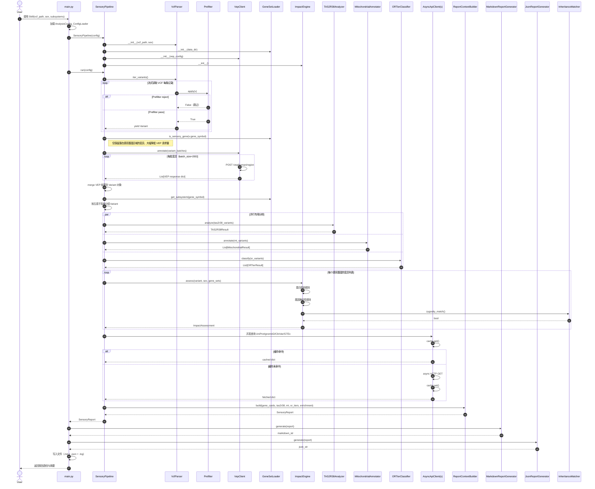
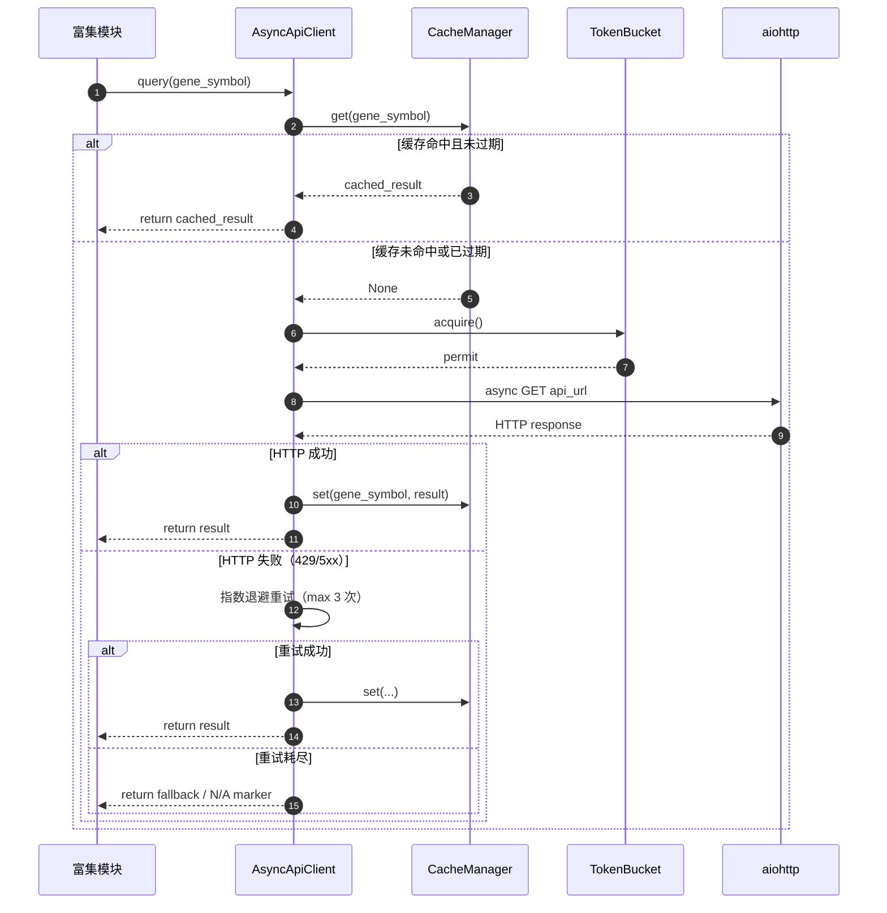
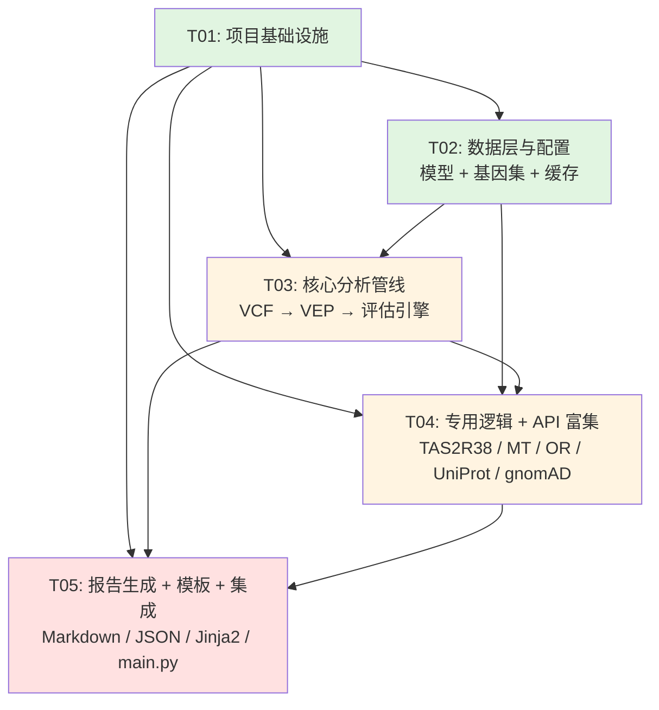

# 感官基因组学分析 Skill — 系统架构设计文档

> **版本**：v0.1.0  
> **作者**：架构师（高见远）  
> **日期**：2026-06-04  
> **对应 PRD**：`Sensory_Genomics_Skill_PRD_v0.1.0.md`（规范化版 `prd.md`）

---

## Part A: System Design

### 1. Implementation Approach

#### 1.1 核心技术分析

| 挑战点 | 分析 | 应对策略 |
|--------|------|----------|
| VCF 文件高效解析 | WGS VCF 可达数 GB，需流式解析且内存 < 2GB | 使用 `pysam.VariantFile` 流式读取，仅保留落在目标基因区域的记录 |
| VEP REST API 可靠性与速率限制 | 单次批量查询可能超时，需重试与限速 | 异步 `aiohttp` 客户端，内置指数退避重试，批量 POST 降低请求数 |
| 感官基因集管理 | 约 500+ 基因，含 OR 基因 ~400 个，需分级展示 | YAML 静态配置 + JSON 数据文件，启动时加载为内存索引（dict/set） |
| 五级功能影响评估 | 需综合蛋白影响 × 基因确定性 × 遗传模式，规则复杂 | 规则引擎模式：`ImpactRule` 接口 + 具体规则实现，便于扩展和单测 |
| 异步 API 富集并发 | UniProt/gnomAD/ClinVar/GTEx 多源并发，各有限速 | 统一 `AsyncApiClient` 抽象，内置 SQLite 缓存 + 令牌桶限速器 |
| 报告生成灵活性 | Markdown 报告结构复杂，需条件渲染和折叠 | Jinja2 模板引擎，按章节组织模板，专用逻辑模块注入上下文 |

#### 1.2 框架与库选型

| 组件 | 选型 | 版本 | 理由 |
|------|------|------|------|
| 运行时 | Python | >=3.10 | 需要 `match-case`、`asyncio` 现代特性 |
| VCF 解析 | `pysam` | >=0.22.0 | 支持 `.vcf`/`.vcf.gz` 流式读取，与 bcftools 一致，内存友好 |
| VEP REST 调用 | `aiohttp` | >=3.9.0 | 异步 HTTP，支持批量 POST、连接池、超时控制 |
| 数据校验/建模 | `pydantic` | >=2.5.0 | 强类型数据模型，JSON 序列化，配置校验 |
| 报告模板 | `Jinja2` | >=3.1.0 | 灵活的 Markdown 模板，条件渲染、循环、宏 |
| 缓存 | `sqlite3` (内置) + `aiosqlite` | >=0.20.0 | 异步 SQLite 避免阻塞事件循环，TTL 30 天 |
| 配置管理 | `PyYAML` | >=6.0.1 | YAML 配置与基因集数据文件 |
| 限速/并发 | `asyncio.Semaphore` + 自定义令牌桶 | — | 精确控制 Ensembl 15 req/s、NCBI 3 req/s |
| 日志 | `logging` (标准库) | — | 结构化日志输出到文件和控制台 |
| 类型提示 | 全量类型注解 + `typing` | — | 代码可维护性，IDE 支持 |

#### 1.3 架构模式

本 Skill 采用 **Pipeline（管道-过滤器）模式** 组织核心分析流程：

```
VCF Input → Prefilter → VEP Annotate → Sensory Filter → Impact Assess
                                                     ↓
Report ← Markdown/JSON Generator ← Specialized Logic ← API Enrichment
```

各阶段职责单一、接口清晰，阶段间通过不可变的 `Pydantic` 模型传递数据，天然支持单元测试和并行优化。

在 API 富集层采用 **Repository + Cache-Aside 模式**：所有外部 API 调用统一封装在 Repository 中，查询前检查 SQLite 缓存，未命中则异步获取并写入缓存。

---

### 2. File List

```
sensory-genomics/
├── SKILL.md                                    # WorkBuddy Skill 入口描述文件
├── requirements.txt                            # Python 依赖声明
├── config.yaml                                 # 默认运行时配置
├── setup.py                                    # 可选：pip install -e . 安装
│
├── src/
│   ├── __init__.py
│   ├── main.py                                 # Skill 主入口：参数解析、管线编排
│   ├── models.py                               # Pydantic 数据模型（Variant, Assessment, Report 等）
│   ├── config_loader.py                        # 配置加载与校验（YAML → Pydantic）
│   ├── exceptions.py                           # 自定义异常体系
│   ├── logger.py                               # 日志配置（统一格式、文件+控制台）
│   │
│   ├── vcf/
│   │   ├── __init__.py
│   │   ├── parser.py                           # VCF 流式解析、字段提取、质控过滤
│   │   └── prefilter.py                        # QUAL/DP/PASS 预过滤规则
│   │
│   ├── vep/
│   │   ├── __init__.py
│   │   ├── client.py                           # VEP REST API 异步客户端（批量查询）
│   │   ├── local_client.py                     # 本地 VEP 调用预留接口（P2 扩展）
│   │   └── batcher.py                          # 变异批量切分（每批 N 个，适配 VEP limit）
│   │
│   ├── gene_sets/
│   │   ├── __init__.py
│   │   ├── loader.py                           # 感官基因集 YAML/JSON 加载、索引构建
│   │   └── filter.py                           # 基因集变异筛选（chr/pos/gene_symbol 匹配）
│   │
│   ├── assessment/
│   │   ├── __init__.py
│   │   ├── engine.py                           # 功能影响评估引擎：规则编排入口
│   │   ├── rules.py                            # ImpactRule 接口 + 蛋白影响/基因确定性/遗传模式规则
│   │   └── inheritance.py                      # 遗传模式判定（隐性/X-连锁/显性/线粒体）
│   │
│   ├── specialized/
│   │   ├── __init__.py
│   │   ├── tas2r38.py                          # TAS2R38 Haplotype 分析器
│   │   ├── mitochondrial.py                    # 线粒体耳聋注释器 + 药物警告
│   │   └── or_tiers.py                         # OR 基因分级展示逻辑（Tier A/B/C）
│   │
│   ├── enrichment/
│   │   ├── __init__.py
│   │   ├── cache.py                            # SQLite 异步缓存（TTL、速率限制）
│   │   ├── client_base.py                      # AsyncApiClient 抽象基类（重试、限速）
│   │   ├── uniprot.py                          # UniProt 查询：蛋白功能、域、拓扑
│   │   ├── gnomad.py                           # gnomAD 人群 AF 查询
│   │   ├── clinvar.py                          # ClinVar 记录查询
│   │   └── gtex.py                             # GTEx 组织表达查询
│   │
│   └── report/
│       ├── __init__.py
│       ├── markdown_generator.py               # Markdown 报告生成器（Jinja2 渲染）
│       ├── json_generator.py                   # JSON 结构化输出生成器
│       └── report_context.py                   # 报告上下文构建器（汇总各模块结果）
│
├── data/
│   ├── sensory_gene_sets.yaml                  # 五大感官子系统基因集定义
│   ├── tas2r38_snps.json                       # TAS2R38 三个 SNP 位点定义
│   ├── mitochondrial_variants.json             # 已知线粒体致聋变异库
│   └── or_ligands.json                         # OR 基因-已知配体映射表（Tier A）
│
└── templates/
    ├── report.md.j2                            # 主报告 Markdown Jinja2 模板
    ├── sections/
    │   ├── disclaimer.md.j2                    # 免责声明
    │   ├── executive_summary.md.j2             # 执行摘要
    │   ├── vision.md.j2                        # 视觉系统章节
    │   ├── hearing.md.j2                       # 听觉系统章节
    │   ├── olfaction.md.j2                     # 嗅觉系统章节
    │   ├── taste.md.j2                         # 味觉系统章节
    │   ├── somatosensation.md.j2               # 触觉/痛觉/温度觉章节
    │   ├── methodology.md.j2                   # 方法学与局限性
    │   └── appendix.md.j2                      # 附录（全部变异 JSON）
    └── macros/
        ├── gene_card.md.j2                     # 基因卡片宏
        └── variant_table.md.j2                 # 变异表格宏
```

---

### 3. Data Structures and Interfaces

```mermaid
classDiagram
    direction TB

    %% ========== Data Models ==========
    class Variant {
        +str chrom
        +int pos
        +str ref
        +str alt
        +str gt
        +int dp
        +float qual
        +str filter_status
        +str gene_symbol
        +str consequence
        +Optional~str~ hgvsc
        +Optional~str~ hgvsp
        +Optional~float~ af_gnomad
        +Optional~str~ protein_domain
        +Optional~str~ protein_topology
        +dict raw_vep
    }

    class ImpactAssessment {
        +str level
        +str protein_impact
        +str gene_certainty
        +bool zygosity_match
        +str inheritance_pattern
        +str rationale_zh
        +Optional~str~ limitation_note
    }

    class GeneCard {
        +str gene_symbol
        +str sensory_function_zh
        +List~Variant~ variants
        +ImpactAssessment assessment
        +Optional~str~ special_logic_type
        +dict enrichment_data
    }

    class TAS2R38Result {
        +str rs713598_gt
        +str rs1726866_gt
        +str rs10246939_gt
        +str diplotype
        +str phenotype_zh
        +str phenotype_level
    }

    class MitochondrialResult {
        +str variant_name
        +str gene
        +float heteroplasmy
        +str drug_warning_zh
        +str risk_level
    }

    class ORTierResult {
        +str tier
        +str gene_symbol
        +Optional~str~ known_ligand_zh
        +Variant variant
        +ImpactAssessment assessment
    }

    class SensoryReport {
        +str sample_id
        +str sex
        +str ref_genome
        +datetime analysis_date
        +List~str~ subsystems
        +List~GeneCard~ gene_cards
        +Optional~TAS2R38Result~ tas2r38
        +Optional~List~MitochondrialResult~~ mitochondrial
        +Optional~List~ORTierResult~~ or_tiers
        +dict executive_summary
        +dict data_availability
        +str disclaimer_zh
    }

    %% ========== Service Classes ==========
    class VcfParser {
        -str vcf_path
        -Sex sex
        +__init__(vcf_path, sex)
        +Iterator~Variant~ iter_variants()
        +List~Variant~ fetch_region(chrom, start, end)
    }

    class Prefilter {
        +int min_qual
        +int min_dp
        +bool pass_only
        +bool apply(Variant v)
    }

    class VepClient {
        -str base_url
        -int batch_size
        -Semaphore rate_limit
        +__init__(config)
        +async List~dict~ annotate(List~Variant~ variants)
        -async dict _post_batch(List~Variant~ batch)
    }

    class GeneSetLoader {
        -dict gene_index
        +__init__(data_dir)
        +bool is_sensory_gene(str gene_symbol)
        +str get_subsystem(str gene_symbol)
        +List~str~ get_genes_for_subsystem(str subsystem)
    }

    class ImpactEngine {
        -List~ImpactRule~ rules
        +__init__()
        +ImpactAssessment assess(Variant v, Sex sex, GeneSetLoader gs)
    }

    class ImpactRule {
        <<abstract>>
        +str name
        +str evaluate(Variant v, Sex sex, GeneSetLoader gs)* str
    }

    class ProteinImpactRule {
        +str evaluate(Variant v, Sex sex, GeneSetLoader gs) str
    }

    class GeneCertaintyRule {
        +str evaluate(Variant v, Sex sex, GeneSetLoader gs) str
    }

    class InheritanceMatcher {
        +bool zygosity_match(Variant v, Sex sex, str expected_pattern)
        +str detect_pattern(str gene_symbol, Sex sex)
    }

    class TAS2R38Analyzer {
        -dict snp_defs
        +TAS2R38Result analyze(List~Variant~ tas2r38_variants)
        -str _call_haplotype(dict snp_gts)
    }

    class MitochondrialAnnotator {
        -dict known_variants
        +List~MitochondrialResult~ annotate(List~Variant~ mt_variants)
    }

    class ORTierClassifier {
        -dict ligand_map
        +List~ORTierResult~ classify(List~Variant~ or_variants)
    }

    class AsyncApiClient {
        <<abstract>>
        -CacheManager cache
        -int max_retries
        +async dict query(str key)*
        -async dict _fetch(str key)*
    }

    class CacheManager {
        -str db_path
        -int default_ttl_days
        +async Optional~dict~ get(str key)
        +async set(str key, dict value)
        +async purge_expired()
    }

    class MarkdownReportGenerator {
        -Environment jinja_env
        +str generate(SensoryReport report)
    }

    class JsonReportGenerator {
        +str generate(SensoryReport report)
    }

    class SensoryPipeline {
        -VcfParser vcf_parser
        -VepClient vep_client
        -GeneSetLoader gene_sets
        -ImpactEngine impact_engine
        -List~Analyzer~ special_analyzers
        +async SensoryReport run(AnalysisConfig config)
        -List~Variant~ _filter_sensory(List~Variant~ annotated)
        -async dict _enrich(List~Variant~ variants)
    }

    class AnalysisConfig {
        +str vcf_path
        +str sex
        +List~str~ subsystems
        +Optional~str~ known_phenotype
        +bool show_reference_info
        +str vep_source
    }

    %% ========== Relationships ==========
    Variant "1" --> "1" ImpactAssessment : assessed by
    GeneCard "1" --> "*" Variant : contains
    GeneCard "1" --> "1" ImpactAssessment : has
    SensoryReport "1" --> "*" GeneCard : contains
    SensoryReport "0..1" --> "1" TAS2R38Result : may contain
    SensoryReport "0..1" --> "*" MitochondrialResult : may contain
    SensoryReport "0..1" --> "*" ORTierResult : may contain

    ImpactEngine "1" --> "*" ImpactRule : orchestrates
    ImpactRule <|-- ProteinImpactRule
    ImpactRule <|-- GeneCertaintyRule

    AsyncApiClient "1" --> "1" CacheManager : uses

    SensoryPipeline "1" --> "1" VcfParser : uses
    SensoryPipeline "1" --> "1" VepClient : uses
    SensoryPipeline "1" --> "1" GeneSetLoader : uses
    SensoryPipeline "1" --> "1" ImpactEngine : uses
    SensoryPipeline "1" --> "*" TAS2R38Analyzer : uses
    SensoryPipeline "1" --> "*" MitochondrialAnnotator : uses
    SensoryPipeline "1" --> "*" ORTierClassifier : uses

    MarkdownReportGenerator ..> SensoryReport : renders
    JsonReportGenerator ..> SensoryReport : serializes
```



---

### 4. Program Call Flow

#### 4.1 主分析流程：从 VCF 到报告



#### 4.2 API 缓存查询子流程



---

### 5. Anything UNCLEAR

| 编号 | 不明确点 | 架构假设 |
|------|---------|----------|
| Q1 | VEP 来源默认 REST API，本地 VEP 预留接口的实现细节 | 架构预留 `local_client.py`，v0.1.0 仅实现 REST API 路径；配置 `vep.source` 控制切换 |
| Q2 | OR 基因 "all_functional_OR_genes" ~400 个的具体列表来源 | 假设由产品/医学团队提供初始列表，存为 `data/or_gene_list.json`；架构支持动态加载 |
| Q3 | 线粒体坐标系统与核基因差异 | 假设 VCF 中 MT 染色体名为 "MT" 或 "chrM"；`MitochondrialAnnotator` 内置坐标映射；VEP REST API 对 MT 基因支持通过标准 `/vep/human/region` 查询，无需特殊 endpoint |
| Q4 | Trio 相位分析在 v0.1.0 范围内？ | PRD 明确为 P2（v0.6.0），架构完全不包含复合杂合相位模块，仅做单样本基因型推断 |
| Q5 | 样本性别来源 | 架构要求用户输入 `sex="M"|"F"`，`InheritanceMatcher` 不自动推断；若输入缺失则抛错 |
| Q6 | gnomAD/ClinVar 等不可用时展示方式 | 模板中统一展示为 "N/A" 并附原因标注（如"API 限速"），不隐藏字段 |
| Q7 | 已知配体 OR 列表（Tier A）初始数据 | 假设由产品团队提供初始映射（OR2T11→鱼腥味等），存为 `data/or_ligands.json`；架构支持空列表降级为全部 Tier B/C |
| Q8 | 首次运行（无缓存）性能指标 | 架构区分：有缓存目标 < 5min，无缓存目标 < 10min；首次运行大量 API 查询可能超时，但核心管线（VCF→VEP→评估）始终 < 2min |
| Q9 | 报告输出路径 | 默认输出到 `~/.workbuddy/skills/sensory-genomics/output/`；配置 `output_dir` 可覆盖；`main.py` 保证目录存在 |
| Q10 | Skill 交互入口与参数收集 | 假设由 WorkBuddy 框架通过自然语言对话触发，`main.py` 接收解析后的参数对象；前端交互设计不在本架构范围 |
| Q11 | 蛋白拓扑位置数据来源 | UniProt 亚细胞定位 + InterPro 域注释推断拓扑（跨膜/胞外/胞内）；若数据缺失则标注 "未推断" |
| Q12 | SpliceAI/CADD 数据来源 | PRD 定位为信息展示，架构通过 VEP `colocated_variants` 或外部 API 获取；若 VEP 已返回则直接用，否则尝试 API |

---

## Part B: Task Decomposition

### 6. Required Packages

```text
# requirements.txt
pysam>=0.22.0          # VCF 解析（支持 vcf.gz 流式读取）
aiohttp>=3.9.0         # 异步 HTTP 客户端（VEP REST + 外部 API）
aiosqlite>=0.20.0      # 异步 SQLite（缓存不阻塞事件循环）
pydantic>=2.5.0        # 数据模型、配置校验
Jinja2>=3.1.0          # Markdown 报告模板
PyYAML>=6.0.1          # 配置与基因集 YAML 解析
```

---

### 7. Task List (ordered by dependency)

#### T01: 项目基础设施

**Task ID**: T01  
**Priority**: P0  
**Dependencies**: —  
**Source Files**:
- `SKILL.md` — WorkBuddy Skill 描述文件（名称、说明、入口）
- `requirements.txt` — Python 依赖声明
- `config.yaml` — 默认运行时配置（VEP、过滤阈值、缓存路径等）
- `setup.py` — 可编辑安装脚本
- `src/__init__.py` — 包初始化
- `src/exceptions.py` — 自定义异常基类（VcfError, VepError, ConfigError 等）
- `src/logger.py` — 统一日志配置（格式、文件+控制台 Handler、级别控制）
- `.gitignore` — 忽略缓存、输出、日志文件

**说明**: 建立 Skill 目录结构，声明所有依赖，定义全局配置格式和异常体系。所有后续任务均依赖此任务完成后的基础环境。

---

#### T02: 数据层与配置（模型 + 基因集 + 缓存）

**Task ID**: T02  
**Priority**: P0  
**Dependencies**: T01  
**Source Files**:
- `src/models.py` — Pydantic 数据模型：Variant, ImpactAssessment, GeneCard, TAS2R38Result, MitochondrialResult, ORTierResult, SensoryReport, AnalysisConfig
- `src/config_loader.py` — YAML 配置加载与 Pydantic 校验（含默认值、路径展开 `~`）
- `src/gene_sets/__init__.py`
- `src/gene_sets/loader.py` — 感官基因集加载器（YAML/JSON → 内存索引字典，支持按子系统查询）
- `src/enrichment/__init__.py`
- `src/enrichment/cache.py` — SQLite 异步缓存管理器（get/set/TTL 过期清理/表初始化）
- `data/sensory_gene_sets.yaml` — 视觉/听觉/嗅觉/味觉/体感五大子系统基因集
- `data/tas2r38_snps.json` — TAS2R38 三个 SNP 定义
- `data/mitochondrial_variants.json` — 已知线粒体致聋变异库
- `data/or_ligands.json` — OR 已知配体映射表

**说明**: 定义全系统共享的数据契约（Pydantic 模型），建立基因集静态数据加载机制，实现缓存基础设施。T03 的分析管线依赖这些模型和加载器。

---

#### T03: 核心分析管线（VCF → VEP → 评估引擎）

**Task ID**: T03  
**Priority**: P0  
**Dependencies**: T01, T02  
**Source Files**:
- `src/vcf/__init__.py`
- `src/vcf/parser.py` — VCF 流式解析器（pysam.VariantFile，提取 GT/DP/GQ/QUAL/AD）
- `src/vcf/prefilter.py` — 预过滤规则（QUAL≥30, DP≥10, PASS only）
- `src/vep/__init__.py`
- `src/vep/client.py` — VEP REST API 异步客户端（批量 POST、指数退避重试、15 req/s 限速）
- `src/vep/batcher.py` — 变异批量切分器（适配 VEP limit，如每批 200 个）
- `src/vep/local_client.py` — 本地 VEP 预留接口（抽象基类，v0.1.0 仅 stub）
- `src/gene_sets/filter.py` — 感官基因精确筛选（基于 VEP 返回的 gene_symbol）
- `src/assessment/__init__.py`
- `src/assessment/engine.py` — 功能影响评估引擎（编排三条规则）
- `src/assessment/rules.py` — ImpactRule 接口 + ProteinImpactRule + GeneCertaintyRule
- `src/assessment/inheritance.py` — 遗传模式匹配器（隐性/X-连锁/显性/线粒体）
- `src/main.py`（部分）— 管线编排入口骨架（VCF → Prefilter → VEP → Filter → Assess 的串接）

**说明**: 实现从原始 VCF 到功能影响评估的核心数据流。这是整个 Skill 的计算引擎，必须优先完成并跑通单样本端到端测试（即使无 API 富集）。

---

#### T04: 专用逻辑模块 + API 富集层

**Task ID**: T04  
**Priority**: P0 / P1  
**Dependencies**: T01, T02, T03  
**Source Files**:
- `src/specialized/__init__.py`
- `src/specialized/tas2r38.py` — TAS2R38 Haplotype 分析器（三个 SNP → diplotype → 苦味表型）
- `src/specialized/mitochondrial.py` — 线粒体耳聋注释器（MT-RNR1/MT-TS1 已知位点匹配 + 异质性 + 药物警告）
- `src/specialized/or_tiers.py` — OR 基因分级展示逻辑（Tier A/B/C 判定，已知配体映射）
- `src/enrichment/client_base.py` — AsyncApiClient 抽象基类（统一重试、限速、缓存逻辑）
- `src/enrichment/uniprot.py` — UniProt 异步查询（蛋白功能、域、拓扑位置）
- `src/enrichment/gnomad.py` — gnomAD 人群 AF 查询
- `src/enrichment/clinvar.py` — ClinVar 记录查询
- `src/enrichment/gtex.py` — GTEx 感官组织表达查询
- `src/report/report_context.py` — 报告上下文构建器（汇总核心管线 + 专用模块 + 富集数据 → SensoryReport）

**说明**: 实现 P0 要求的特殊基因处理（OR/TAS2R38/MT-RNR1）和 P1 的 API 富集（UniProt/gnomAD/ClinVar/GTEx）。专用逻辑与评估引擎解耦，通过 `SensoryPipeline` 统一注入报告上下文。

---

#### T05: 报告生成 + 模板 + 集成与测试

**Task ID**: T05  
**Priority**: P0 / P1  
**Dependencies**: T01, T02, T03, T04  
**Source Files**:
- `src/report/__init__.py`
- `src/report/markdown_generator.py` — Markdown 报告生成器（Jinja2 Environment，加载模板目录）
- `src/report/json_generator.py` — JSON 结构化输出生成器（Pydantic model_dump_json）
- `templates/report.md.j2` — 主报告模板（包含各章节 include）
- `templates/sections/disclaimer.md.j2` — 免责声明（强制置顶）
- `templates/sections/executive_summary.md.j2` — 执行摘要 + 感官概览表
- `templates/sections/vision.md.j2` — 视觉系统（含 OPN1LW CNV 局限说明）
- `templates/sections/hearing.md.j2` — 听觉系统（含线粒体药物警告）
- `templates/sections/olfaction.md.j2` — 嗅觉系统（Tier A 高亮 + Tier B 列表 + Tier C 附录）
- `templates/sections/taste.md.j2` — 味觉系统（TAS2R38 haplotype 展示）
- `templates/sections/somatosensation.md.j2` — 触觉/痛觉/温度觉
- `templates/sections/methodology.md.j2` — 方法学与已知局限
- `templates/sections/appendix.md.j2` — 附录（全部变异 JSON 折叠）
- `templates/macros/gene_card.md.j2` — 基因卡片宏（固定字段渲染）
- `templates/macros/variant_table.md.j2` — 变异表格宏
- `src/main.py`（完整）— Skill 最终主入口：参数校验 → Pipeline.run() → 报告写入 → 日志收尾
- `tests/` — 单元测试与集成测试（工程师根据时间补充，本任务至少包含端到端冒烟测试）

**说明**: 实现人类可读 Markdown 报告和机器可读 JSON 输出。模板按章节独立，便于维护和内容调整。`main.py` 最终集成所有模块，完成端到端 Skill 入口。

---

### 8. Shared Knowledge

以下约定跨多个文件和模块，所有开发者必须遵循：

**编码规范**
- 所有公共函数和类必须带类型注解，返回值类型不可省略。
- 异步函数统一使用 `async def`，同步阻塞 IO（如 SQLite 写）必须通过 `aiosqlite` 或 `asyncio.to_thread()` 包装。
- 文件内使用 `__all__` 显式导出公共 API。

**数据契约**
- 所有跨模块传递的结构化数据必须使用 `src/models.py` 中定义的 Pydantic 模型，禁止裸 `dict` 传递。
- 枚举值（如影响程度、遗传模式）使用 `Literal` 或 `StrEnum`，禁止魔法字符串。
- 中文报告文本统一在模板或 `rationale_zh`/`phenotype_zh` 字段中维护，代码逻辑层尽量用英文标识符。

**错误处理**
- 使用 `src/exceptions.py` 中定义的异常层次：`SensoryGenomicsError` → `VcfError|VepError|ConfigError|ApiError|AssessmentError`。
- API 调用失败时，若重试耗尽，返回带 `error: str` 标记的降级结果（而非抛异常终止整个管线），确保报告仍可生成。
- VCF 解析遇到单条记录异常时，记录 warning 日志并跳过该记录，不终止流程。

**日志规范**
- 统一通过 `src/logger.py` 获取 `logging.Logger`，禁止直接 `print()`。
- 日志级别：DEBUG（API 请求详情）、INFO（阶段开始/完成）、WARNING（单条记录跳过、API 降级）、ERROR（阶段失败但可降级）、CRITICAL（不可恢复，终止）。
- 日志文件按运行时间命名：`sensory_genomics_YYYYMMDD_HHMMSS.log`。

**缓存与限速**
- 缓存键格式：`{api_name}:{query_key}`，如 `uniprot:OPN1LW`。
- TTL 默认 30 天，在 `cache.py` 中统一实现，各 API Client 不可私自处理 TTL。
- 限速：Ensembl VEP 15 req/s、NCBI/ClinVar 3 req/s、UniProt 无严格限制（保守 10 req/s）。使用 `asyncio.Semaphore` 实现。

**性能约束**
- 单样本内存上限 2GB：VCF 解析必须流式，禁止一次性加载全文件；VEP 注释按批处理，不囤积全部未注释变异。
- 分析时间有缓存 < 5min：通过批量 VEP 请求 + 本地缓存保证；无缓存 < 10min。

**伦理与合规**
- 任何模块生成面向用户的文本时，禁止使用 "致病"、"患者"、"诊断" 等词汇。
- OR 基因 LoF 必须标注为 "特定嗅觉受体缺失" 而非 "致病"。
- SCN9A/PIEZO2 等高风险基因阳性结果必须附带 "建议遗传咨询" 提示。
- 免责声明不可通过配置关闭，必须强制出现在报告首页。

---

### 9. Task Dependency Graph



**依赖说明**:
- T01 为所有任务的基础，无前置依赖。
- T02 提供数据模型和基因集，T03 依赖 T02 的模型进行 VEP 和评估。
- T04 依赖 T03 的评估结果，同时依赖 T02 的缓存做 API 富集。
- T05 依赖前四个任务的全部产出，为最终集成和输出层。
- **T02、T03、T04 之间尽量减少线性依赖**：T04 虽然依赖 T03，但 API 富集层（client_base/uniprot/gnomad 等）可基于 T01+T02 独立开发，仅最终与 T03 的集成需要 T03 完成。
